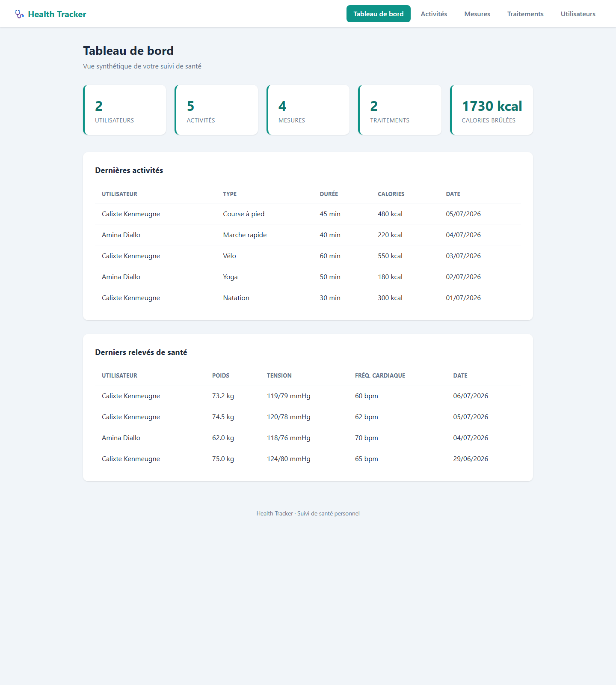
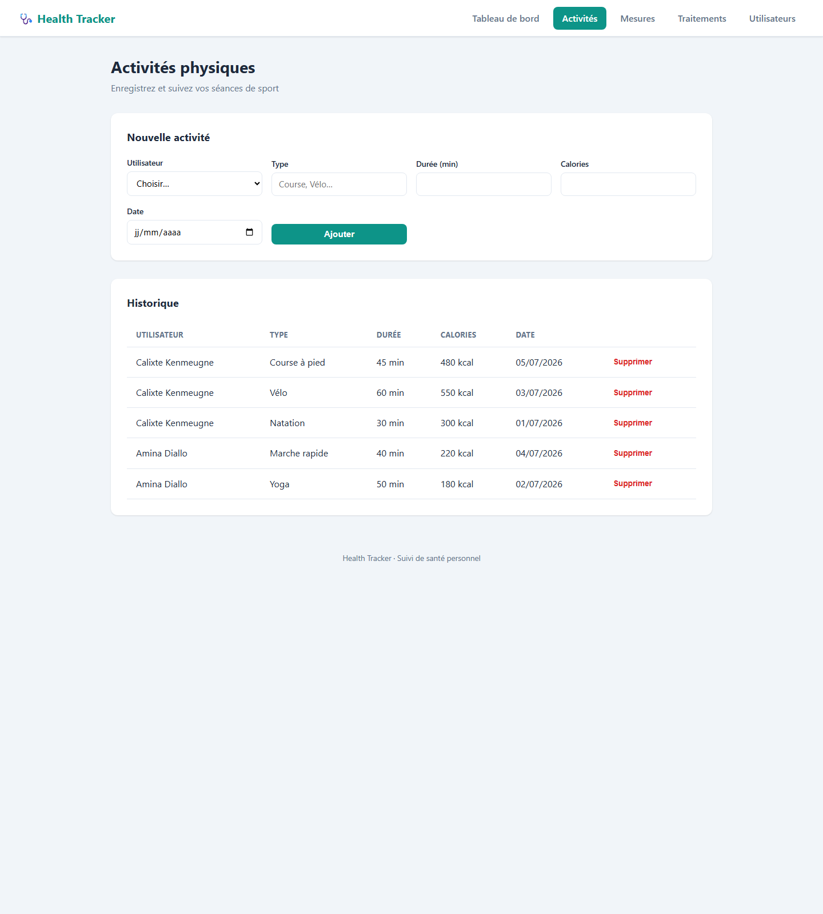
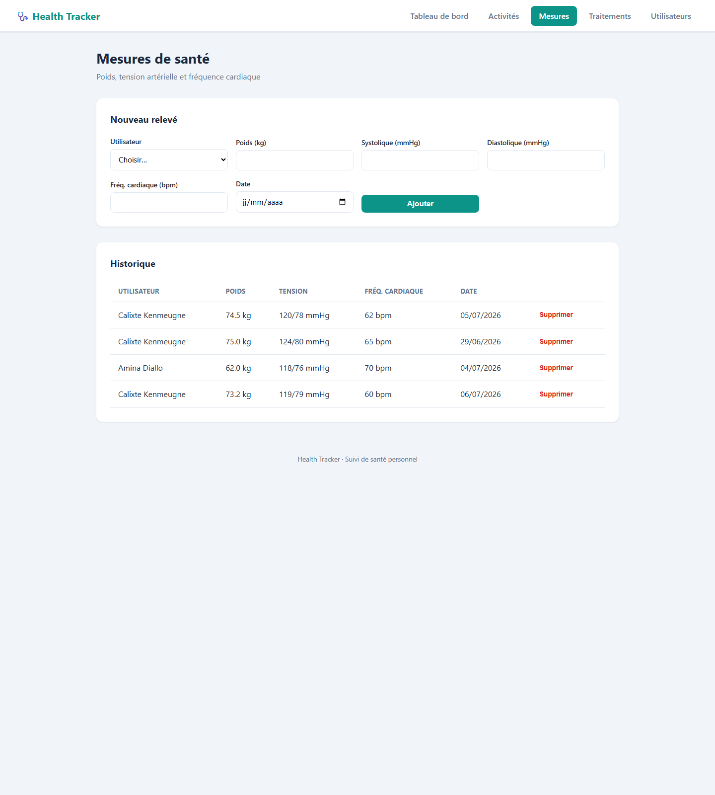
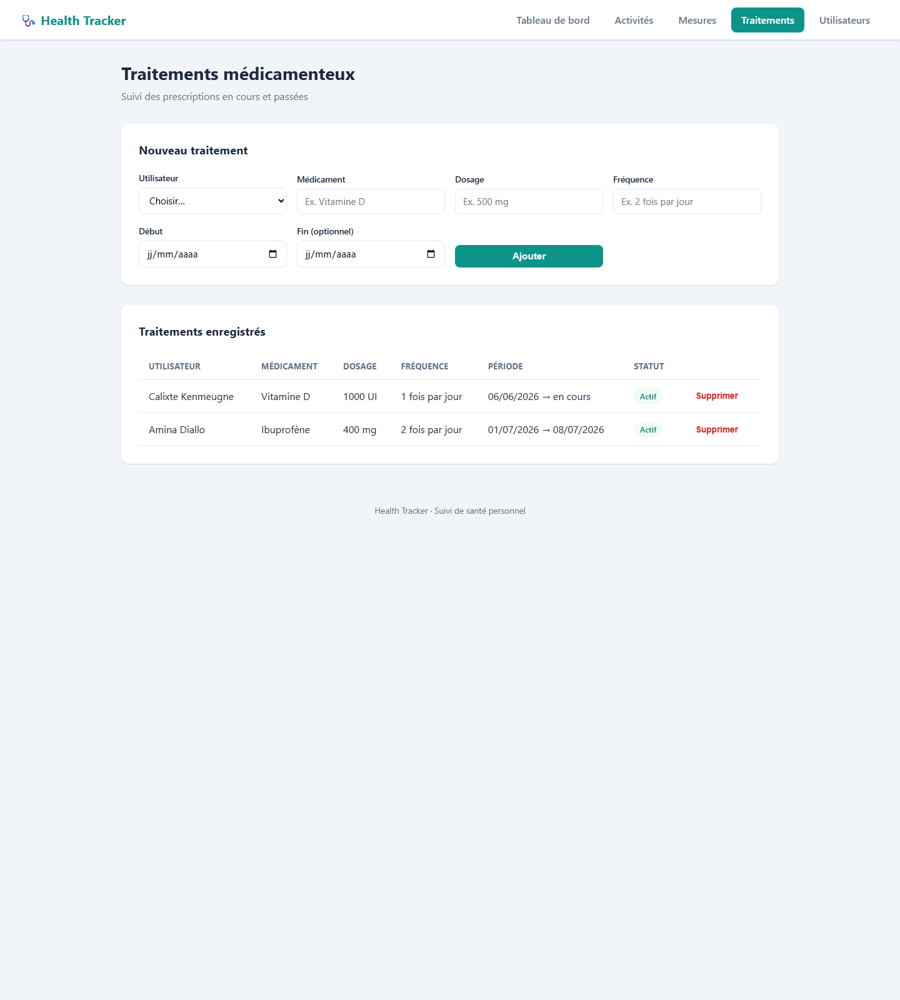

<H1 align="center" > <b> 🩺 Health Tracker </b></H1>

<p align="center">
  
  
  
  
  
  
</p>
Une application web de suivi de santé personnel que j'ai construite avec **Spring Boot 3** et **Java 17**. L'idée est simple : centraliser au même endroit les activités physiques, les mesures de santé (poids, tension, fréquence cardiaque) et les traitements médicamenteux d'un ou plusieurs utilisateurs, le tout dans une interface web claire.

Je m'en sers comme projet de référence pour démontrer une architecture Spring Boot propre, en couches, avec de la validation métier sérieuse et une persistance JPA.

---

## Ce que fait l'application

- **Gestion des utilisateurs** : création, consultation, suppression. Chaque utilisateur a son profil (âge, poids, taille) et son IMC est calculé automatiquement.
- **Suivi des activités** : j'enregistre chaque séance (type, durée, calories brûlées, date).
- **Mesures de santé** : relevés de poids, tension artérielle systolique/diastolique et fréquence cardiaque.
- **Traitements** : les médicaments avec dosage, fréquence et période, et un statut « Actif / Terminé » calculé à la volée.
- **Tableau de bord** : une vue synthétique qui agrège tous les indicateurs et les dernières entrées.

---

## Aperçu






---

## Stack technique

| Domaine | Choix |
|---|---|
| Langage | Java 17 |
| Framework | Spring Boot 3.3 |
| Persistance | Spring Data JPA + Hibernate |
| Base de données | H2 (en mémoire, pour le développement) |
| Vues | Thymeleaf + CSS moderne |
| Validation | Jakarta Bean Validation |
| Build | Maven |

---

## Comment l'architecture est organisée

J'ai suivi une séparation stricte en couches. Chaque requête traverse toujours le même chemin, ce qui rend le code prévisible et testable :

```
Navigateur → Controller → Service (interface + impl) → Repository → Base H2
```

- **`model`** : les entités JPA : `User`, `Activity`, `Measure`, `Medication`. C'est ici que vivent les contraintes de validation.
- **`repository`** : les interfaces Spring Data JPA. Aucune requête SQL écrite à la main pour le CRUD de base.
- **`service`** : la logique métier, découpée en **interface + implémentation** pour respecter l'inversion de dépendance. C'est la seule couche qui porte les transactions.
- **`controller`** : le point d'entrée HTTP. Il valide les entrées et ne contient aucune logique métier.

Le détail complet, avec le **diagramme de classes** (relations One-to-Many) et le **diagramme de séquence** de l'enregistrement d'une mesure, se trouve dans [`docs/ARCHITECTURE.md`](docs/ARCHITECTURE.md).

### Structure des packages

```
com.health.health_tracker
├── model         → User, Activity, Measure, Medication
├── repository    → UserRepository, ActivityRepository, MeasureRepository, MedicationRepository
├── service       → UserService, ActivityService, MeasureService, MedicationService (+ impl)
├── controller    → Dashboard, User, Activity, Measure (+ GlobalExceptionHandler)
└── exception     → ResourceNotFoundException
```

---

## La validation, au cœur du projet

Chaque donnée saisie est vérifiée **avant** d'atteindre la base, grâce aux annotations Jakarta. Quelques exemples concrets :

- **Âge** : `@Min(0) @Max(130)` : impossible d'enregistrer un âge absurde.
- **Poids / Taille** : `@DecimalMin` / `@DecimalMax` : bornés à des plages physiologiquement réalistes.
- **Tension artérielle** : systolique et diastolique bornées séparément.
- **Dates** : `@PastOrPresent` : on ne peut pas enregistrer une activité dans le futur.

Si une contrainte échoue, le contrôleur réaffiche le formulaire avec les messages d'erreur en français, sans jamais planter.

---

## Lancer le projet en local

> Prérequis : **JDK 17+** et **Maven** installés.

```bash
# 1. Se placer dans le dossier du projet
cd health-tracker

# 2. Lancer l'application
mvn spring-boot:run
```

Puis ouvrir **http://localhost:8080**.

Un jeu de données de démonstration est chargé automatiquement au démarrage, donc le tableau de bord n'est pas vide dès la première visite.

La console H2 est accessible sur **http://localhost:8080/h2-console**
(JDBC URL : `jdbc:h2:mem:healthdb`, utilisateur : `sa`, pas de mot de passe).

---

## Lancer les tests

```bash
mvn test
```

Le test de fumée vérifie que le contexte Spring démarre et que tous les composants se câblent correctement.

---

## Auteur

Projet développé par **Calixte Kenmeugne**.
