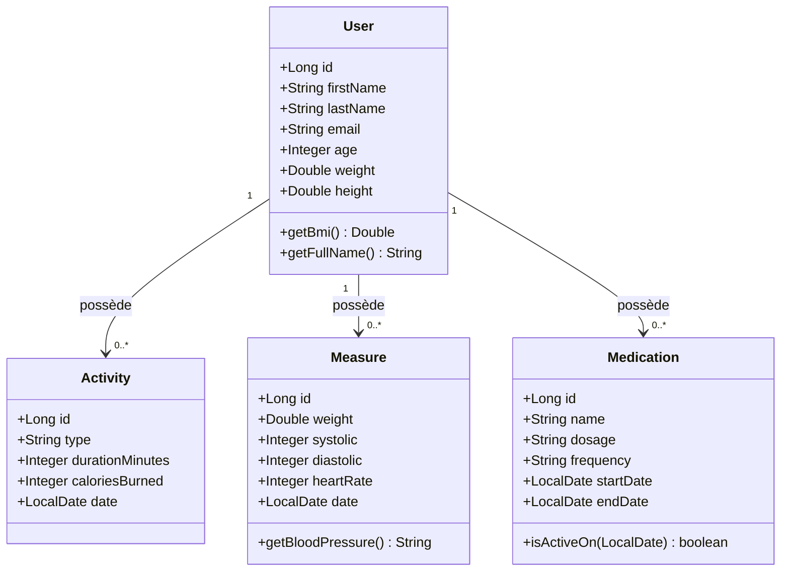
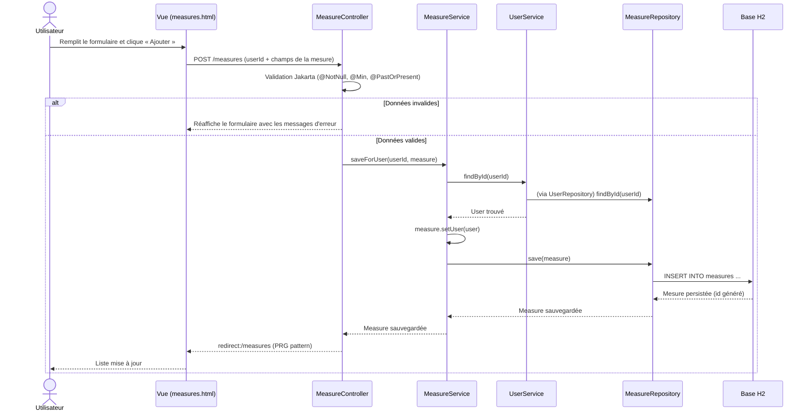

# Architecture — Health Tracker

Ce document décrit la structure interne de l'application et illustre le flux
des données à travers les couches, à l'aide de diagrammes Mermaid.

## Vue en couches

L'application suit une architecture en couches classique de Spring Boot :

```
Navigateur (Thymeleaf HTML)
        │
        ▼
   Controller   ← reçoit les requêtes HTTP, valide les entrées
        │
        ▼
    Service     ← contient la logique métier, gère les transactions
        │
        ▼
   Repository   ← accès aux données (Spring Data JPA)
        │
        ▼
   Base H2      ← persistance SQL
```

## Diagramme de classes

Relations One-to-Many entre `User` et ses entités enfants (`Activity`,
`Measure`, `Medication`). Un utilisateur possède plusieurs activités, mesures
et traitements ; chaque enfant appartient à un seul utilisateur.



## Diagramme de séquence — enregistrement d'une mesure

Flux complet lorsqu'un utilisateur enregistre une mesure de santé depuis le
formulaire, en traversant Contrôleur → Service → Repository.


